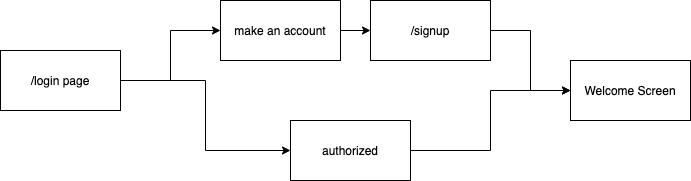

# Login Project

### Overview
In this project we had to make an authentication flow. For this I used Spring Boot utilizing an MVC layout. This includes a user model and login & signup controllers. Three JVCs were utilized to create a view (login, signup, and welcome). These allow the user to login and see user information or to create a new account and see user information. 

